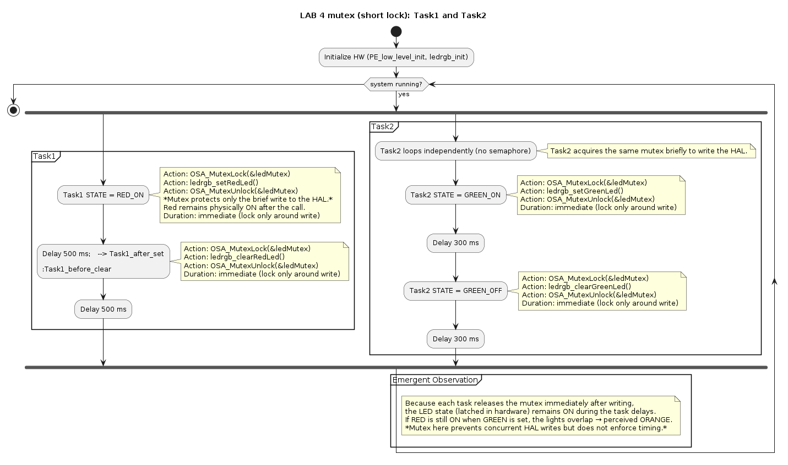

# 🧩 LAB-4: Temporal Execution and Interaction Between Tasks and LEDs — FreeRTOS-Based System

## 📘 System Context

The system consists of two concurrent **FreeRTOS tasks** that control RGB LEDs on the **MKL25Z128VLK4** board:

| Task | Priority | Function | Controlled LED |
|------|-----------|-----------|----------------|
| **Task1** | 1 (lower) | Turns the **red** LED ON and OFF every 500 ms | 🔴 Red |
| **Task2** | 2 (higher) | Turns the **green** LED ON and OFF (300 ms ON / 300 ms OFF) when it receives the semaphore | 🟢 Green |

## Using a Binary Semaphore | 🟢 Green 🔴 Red |

A **binary semaphore** (`ledSema`) is used for synchronization:  
- `Task1` **gives** (`xSemaphoreGive()`) the semaphore.  
- `Task2` **takes** (`xSemaphoreTake()`) the semaphore.  
- The `give` occurs **before** Task1 turns off the red LED.

---

## ⚙️ SYSML Diagram

---

## ⚙️ Operation and Interaction

1. **Task1** begins by turning on the red LED and remains blocked for 500 ms (`vTaskDelay(500)`).
2. After this period, it **gives the semaphore** (`xSemaphoreGive(ledSema)`).
3. Since **Task2 has a higher priority (2)**, the **kernel immediately preempts Task1** and switches to Task2.
4. **Task2** turns on the green LED and remains ON for 300 ms (`vTaskDelay(300)`).
5. During this time, the **red LED remains ON**, creating an **overlap (red + green = orange)**.
6. Task2 then turns off the green LED and enters `vTaskDelay(300)`.
7. Task1 resumes execution and turns off the red LED (`ledrgb_clearRedLed()`).
8. The cycle repeats indefinitely, maintaining the same temporal pattern.

---

## 🧩 Temporal Table — Deterministic Execution (Task2 Preempts Task1)

| Time (ms) | Action / State | Running Task | LED Status | Explanation |
|------------|----------------|---------------|-------------|--------------|
| **0 – 500** | `ledrgb_setRedLed()` → delay 500 ms | 🟥 **Task1 (RED_ON)** | 🔴 Red ON 🟢 Green OFF | Task1 turns on the red LED and blocks for 500 ms. Task2 is still waiting for the semaphore. |
| **≈ 500** | `xSemaphoreGive(ledSema)` | 🟥 **Task1** → 🟢 **Task2 (preemption)** | 🔴 Red ON 🟢 Green ON | Task1 releases the semaphore; the kernel switches to Task2 (higher priority). Task2 turns on the green LED before Task1 turns the red LED off. |
| **500 – 800** | `ledrgb_setGreenLed()` → delay 300 ms | 🟢 **Task2 (GREEN_ON)** | 🟠 **Orange (RED + GREEN)** | Both LEDs are ON simultaneously → perceived orange light. |
| **≈ 800** | `ledrgb_clearGreenLed()` → delay 300 ms | 🟢 **Task2 (GREEN_OFF)** | 🔴 Red still ON (briefly) | Task2 turns off the green LED. Task1 hasn’t resumed yet, so the red remains ON briefly. |
| **800 – 1000** | `ledrgb_clearRedLed()` → delay 500 ms | 🟥 **Task1 (RED_OFF)** | 🔴 Red OFF 🟢 Green OFF | Task1 resumes and turns off the red LED. Both LEDs are now OFF. |
| **1000 – 1500** | `ledrgb_setRedLed()` → delay 500 ms | 🟥 **Task1 (new cycle)** | 🔴 Red ON | The cycle restarts, repeating the same timing pattern with guaranteed overlap between 500–800 ms. |

---

## 🧠 Logical Event Summary

| Step | Event | Action | Result |
|------|--------|--------|---------|
| (1) | Task1 turns RED ON | `ledrgb_setRedLed()` | Red ON for 500 ms |
| (2) | Task1 gives semaphore | `xSemaphoreGive(ledSema)` | Task2 wakes up and preempts Task1 |
| (3) | Task2 turns GREEN ON | `ledrgb_setGreenLed()` | Green turns ON while red is still ON → **orange visible** |
| (4) | Task2 turns GREEN OFF | `ledrgb_clearGreenLed()` | End of overlap |
| (5) | Task1 resumes and turns RED OFF | `ledrgb_clearRedLed()` | Both LEDs OFF |
| (6) | Task1 starts new cycle | `ledrgb_setRedLed()` | Cycle restarts |

---

## 🧮 System Parameters

| Parameter | Value |
|------------|--------|
| Task1 period | 1000 ms |
| RED duty cycle | 50% |
| RED ON delay | 500 ms |
| RED OFF delay | 500 ms |
| GREEN ON delay | 300 ms |
| GREEN OFF delay | 300 ms |
| Semaphore | Binary (`xSemaphoreCreateBinary()`) |
| Task1 priority | 1 |
| Task2 priority | 2 |
| Emergent effect | **Light overlap (orange)** between 500 – 800 ms |

---

## 🧭 Final Interpretation

- The **semaphore** adds no delay — it only synchronizes task execution.  
- The **operation order** (giving the semaphore **before** clearing red) and the **higher priority of Task2** cause the **natural overlap**.  
- The **system is deterministic**: the same timing pattern repeats every cycle, with orange visible between **500 ms and 800 ms**.  
- The **emergent orange effect** is a **physical phenomenon**, not a software-level calculation or check.

---

## 🧩 Behavioral Alternatives

| Objective | Code Change | Result |
|------------|-------------|---------|
| **Eliminate overlap (only red OR green)** | Move `ledrgb_clearRedLed()` **before** `xSemaphoreGive()` in `Task1` | Task2 only turns green ON after red is OFF |
| **Keep overlap (orange)** ✅ | Keep `xSemaphoreGive()` **before** `ledrgb_clearRedLed()` (current order) + Task2 priority > Task1 | Ensures visible orange between 500–800 ms |
| **Strict alternation (no interference)** | Add a second acknowledgment semaphore (Task2 returns signal to Task1) | Full control over execution order |

---

## 📊 Conclusion

> With **Task2 (green)** at **higher priority (2)**  
> and **Task1 (red)** at **lower priority (1)**,  
> the system consistently produces a **predictable overlap phase** of approximately **300 ms**, perceived as **orange**, between **500 ms and 800 ms** in each 1-second cycle.

# 🧩 Using a Mutex for LED Synchronization | 🟢 Green 🔴 Red |

A **mutex (mutual exclusion lock)** is used to **protect shared resources** — in this case, the LED hardware.  
Unlike a semaphore, the **mutex does not signal or wake up other tasks**; instead, it ensures that **only one task** can control the LEDs at a time.

In this experiment:
- `Task1` and `Task2` both call the LED driver (`ledrgb_*`), which accesses shared GPIOs.  
- A **mutex** (`ledMutex`) is used to ensure exclusive access to the LED hardware during write operations.  
- Each task **locks** (`OSA_MutexLock()`) before modifying the LED, and **unlocks** (`OSA_MutexUnlock()`) afterward.  

---

## ⚙️ SYSML Diagram

---

## ⚙️ Operation and Interaction

1. **Task1** starts by acquiring the mutex and turning ON the **red LED**.  
   After setting the LED, it **releases the mutex**, but the red LED **stays ON** physically during its 500 ms delay.  
2. Meanwhile, **Task2** can also acquire the mutex, since Task1 already released it.  
   It locks, turns ON the **green LED**, and releases the mutex.  
3. As a result, both LEDs remain ON simultaneously for part of the cycle, creating the **same orange overlap** effect.  
4. Later, each task locks again to turn OFF its LED after their respective delays.  
5. The cycle repeats indefinitely, maintaining a deterministic pattern.

---

## 🧩 Temporal Table — Deterministic Execution (Short Mutex Section)

| Time (ms) | Action / State | Running Task | LED Status | Explanation |
|------------|----------------|---------------|-------------|--------------|
| **0 – 500** | `OSA_MutexLock()` → `ledrgb_setRedLed()` → `OSA_MutexUnlock()` → delay 500 ms | 🟥 **Task1 (RED_ON)** | 🔴 Red ON 🟢 Green OFF | Task1 sets the red LED ON. The mutex protects the access but is released immediately after writing. |
| **≈ 500** | Task2 obtains mutex and sets GREEN ON | 🟢 **Task2 (GREEN_ON)** | 🟠 **Orange (RED + GREEN)** | Both LEDs ON simultaneously → perceived orange. The mutex does not prevent overlap because it only protects brief access to GPIOs. |
| **500 – 800** | `ledrgb_setGreenLed()` → delay 300 ms | 🟢 **Task2 (GREEN_ON)** | 🟠 Orange | Both LEDs remain ON during this interval. |
| **≈ 800** | Task2 locks → clears GREEN → unlocks | 🟢 **Task2 (GREEN_OFF)** | 🔴 Red still ON | Task2 finishes; red LED remains ON until Task1 clears it later. |
| **800 – 1000** | Task1 locks → clears RED → unlocks | 🟥 **Task1 (RED_OFF)** | 🔴 OFF 🟢 OFF | Task1 clears red LED; both are OFF. |
| **1000 – 1500** | Task1 locks → sets RED → unlocks → delay | 🟥 **Task1 (next cycle)** | 🔴 Red ON | New cycle starts; overlap will reappear at 500–800 ms. |

---

## 🧠 Logical Event Summary

| Step | Event | Action | Result |
|------|--------|--------|---------|
| (1) | Task1 locks and turns RED ON | `OSA_MutexLock()` → `ledrgb_setRedLed()` → `OSA_MutexUnlock()` | Red LED ON |
| (2) | Task1 waits 500 ms | `vTaskDelay(500)` | Red remains ON (no lock held) |
| (3) | Task2 locks and turns GREEN ON | `OSA_MutexLock()` → `ledrgb_setGreenLed()` → `OSA_MutexUnlock()` | Green ON + Red ON → **Orange visible** |
| (4) | Task2 waits 300 ms | `vTaskDelay(300)` | Both LEDs ON |
| (5) | Task2 clears GREEN | `OSA_MutexLock()` → `ledrgb_clearGreenLed()` → `OSA_MutexUnlock()` | Green OFF |
| (6) | Task1 clears RED later | `OSA_MutexLock()` → `ledrgb_clearRedLed()` → `OSA_MutexUnlock()` | Both OFF |
| (7) | Cycle restarts | — | Overlap repeats predictably |

---

## 🧮 System Parameters

| Parameter | Value |
|------------|--------|
| Task1 period | 1000 ms |
| RED duty cycle | 50% |
| RED ON delay | 500 ms |
| RED OFF delay | 500 ms |
| GREEN ON delay | 300 ms |
| GREEN OFF delay | 300 ms |
| Mutex | `OSA_MutexCreate()` / `OSA_MutexLock()` / `OSA_MutexUnlock()` |
| Task1 priority | 1 |
| Task2 priority | 2 |
| Emergent effect | **Light overlap (orange)** between 500 – 800 ms |

---

## 🧭 Final Interpretation

- The **mutex** provides *mutual exclusion*, not synchronization.  
  It prevents concurrent access to the LED driver but does **not** enforce timing or ordering between tasks.  
- Because both tasks release the mutex immediately after writing, the **LEDs remain ON** physically, leading to **overlap (orange)**.  
- The **system is deterministic** — the overlap happens at the same period in every cycle.  
- The **orange color** is again a **physical result** of concurrent illumination, not a software computation.

---

## 🧩 Behavioral Alternatives (with Mutex)

| Objective | Code Change | Result |
|------------|-------------|---------|
| **Eliminate overlap (strict exclusivity)** | Hold the mutex during the entire ON duration (`lock → set → delay → clear → unlock`) | ✅ No overlap, but blocks other tasks for the full ON period |
| **Protect only HAL access (current behavior)** | Keep short mutex section (`lock → set → unlock`) | ⚠️ Overlap occurs; more realistic in multitasking systems |
| **Combine with semaphore for timing control** | Use semaphore to control when Task2 runs + short mutex for hardware access | ✅ Best compromise — no overlap, good responsiveness |

---

## ⚖️ Mutex vs Semaphore — Conceptual Comparison

| Feature | **Binary Semaphore** | **Mutex** |
|----------|----------------------|-----------|
| Purpose | **Signaling / synchronization** between tasks | **Mutual exclusion** for shared resources |
| Ownership | Anonymous — any task can `give` or `take` | Owned — only the task that locks can unlock |
| Priority inheritance | ❌ No (depends on RTOS implementation) | ✅ Yes — prevents priority inversion |
| Can be used from ISR | ✅ Often yes | ❌ Usually no |
| Used for timing control | ✅ Yes | ❌ No (mutex doesn’t schedule) |
| Common use case | Handshaking between tasks | Protecting critical sections / drivers |
| Effect on LEDs here | Causes **overlap** if `give` occurs before `clear` | Causes **overlap** if lock released before OFF |
| Way to remove overlap | `clear` before `give` | Hold mutex during ON or add semaphore |

---

## 📊 Conclusion

> In this FreeRTOS system:
> - The **mutex** ensures atomic access to LED control functions.  
> - However, it **does not prevent concurrent LED states**, because it only protects brief access (not the ON period).  
> - To completely avoid overlap (orange), the mutex must be **held during the full ON duration** — which serializes tasks but breaks responsiveness.  
> - Therefore, the **semaphore approach (with proper order: clear → give)** is generally the preferred way to coordinate timing between tasks.

---

## ✅ Summary

| Mechanism | Used for | Prevents overlap? | Recommended usage |
|------------|-----------|------------------|-------------------|
| **Semaphore** | Signaling between tasks | ⚠️ Only if ordered correctly (`clear → give`) | Task synchronization |
| **Mutex** | Protecting hardware access | ❌ Not by itself | Short critical sections |
| **Semaphore + Mutex** | Signaling + protection | ✅ Yes | Robust, realistic multitasking |

---
