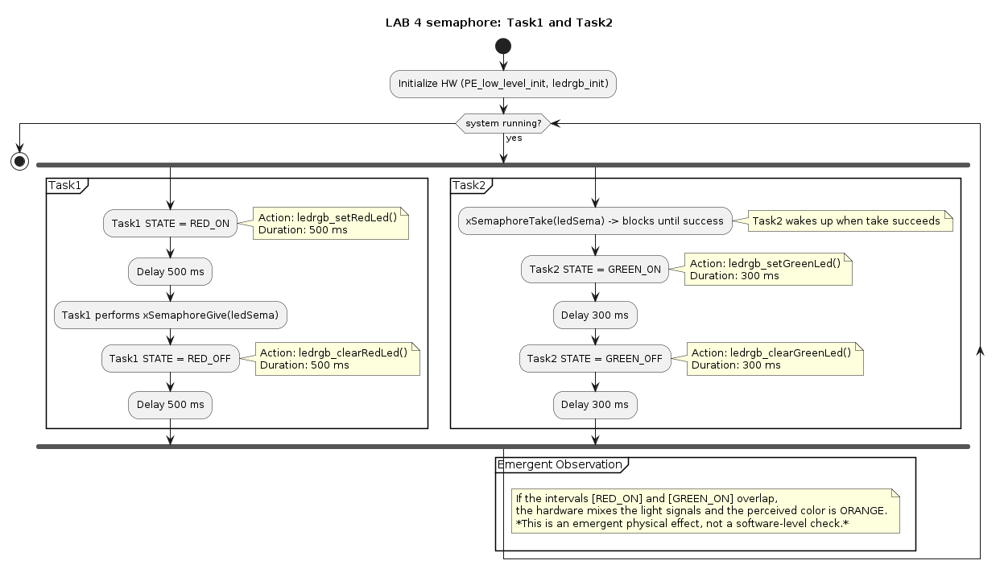

# 🧩 LAB-4: Temporal Execution and Interaction Between Tasks and LEDs — FreeRTOS-Based System

## 📘 System Context

The system consists of two concurrent **FreeRTOS tasks** that control RGB LEDs on the **MKL25Z128VLK4** board:

| Task | Priority | Function | Controlled LED |
|------|-----------|-----------|----------------|
| **Task1** | 1 (lower) | Turns the **red** LED ON and OFF every 500 ms | 🔴 Red |
| **Task2** | 2 (higher) | Turns the **green** LED ON and OFF (300 ms ON / 300 ms OFF) when it receives the semaphore | 🟢 Green |

## Using a Binary Semaphore | 🟢 Green 🔴 Red |

A **binary semaphore** (`ledSema`) is used for synchronization:  
- `Task1` **gives** (`xSemaphoreGive()`) the semaphore.  
- `Task2` **takes** (`xSemaphoreTake()`) the semaphore.  
- The `give` occurs **before** Task1 turns off the red LED.

---

## ⚙️ SYSML Diagram

---

## ⚙️ Operation and Interaction

1. **Task1** begins by turning on the red LED and remains blocked for 500 ms (`vTaskDelay(500)`).
2. After this period, it **gives the semaphore** (`xSemaphoreGive(ledSema)`).
3. Since **Task2 has a higher priority (2)**, the **kernel immediately preempts Task1** and switches to Task2.
4. **Task2** turns on the green LED and remains ON for 300 ms (`vTaskDelay(300)`).
5. During this time, the **red LED remains ON**, creating an **overlap (red + green = orange)**.
6. Task2 then turns off the green LED and enters `vTaskDelay(300)`.
7. Task1 resumes execution and turns off the red LED (`ledrgb_clearRedLed()`).
8. The cycle repeats indefinitely, maintaining the same temporal pattern.

---

## 🧩 Temporal Table — Deterministic Execution (Task2 Preempts Task1)

| Time (ms) | Action / State | Running Task | LED Status | Explanation |
|------------|----------------|---------------|-------------|--------------|
| **0 – 500** | `ledrgb_setRedLed()` → delay 500 ms | 🟥 **Task1 (RED_ON)** | 🔴 Red ON 🟢 Green OFF | Task1 turns on the red LED and blocks for 500 ms. Task2 is still waiting for the semaphore. |
| **≈ 500** | `xSemaphoreGive(ledSema)` | 🟥 **Task1** → 🟢 **Task2 (preemption)** | 🔴 Red ON 🟢 Green ON | Task1 releases the semaphore; the kernel switches to Task2 (higher priority). Task2 turns on the green LED before Task1 turns the red LED off. |
| **500 – 800** | `ledrgb_setGreenLed()` → delay 300 ms | 🟢 **Task2 (GREEN_ON)** | 🟠 **Orange (RED + GREEN)** | Both LEDs are ON simultaneously → perceived orange light. |
| **≈ 800** | `ledrgb_clearGreenLed()` → delay 300 ms | 🟢 **Task2 (GREEN_OFF)** | 🔴 Red still ON (briefly) | Task2 turns off the green LED. Task1 hasn’t resumed yet, so the red remains ON briefly. |
| **800 – 1000** | `ledrgb_clearRedLed()` → delay 500 ms | 🟥 **Task1 (RED_OFF)** | 🔴 Red OFF 🟢 Green OFF | Task1 resumes and turns off the red LED. Both LEDs are now OFF. |
| **1000 – 1500** | `ledrgb_setRedLed()` → delay 500 ms | 🟥 **Task1 (new cycle)** | 🔴 Red ON | The cycle restarts, repeating the same timing pattern with guaranteed overlap between 500–800 ms. |

---

## 🧠 Logical Event Summary

| Step | Event | Action | Result |
|------|--------|--------|---------|
| (1) | Task1 turns RED ON | `ledrgb_setRedLed()` | Red ON for 500 ms |
| (2) | Task1 gives semaphore | `xSemaphoreGive(ledSema)` | Task2 wakes up and preempts Task1 |
| (3) | Task2 turns GREEN ON | `ledrgb_setGreenLed()` | Green turns ON while red is still ON → **orange visible** |
| (4) | Task2 turns GREEN OFF | `ledrgb_clearGreenLed()` | End of overlap |
| (5) | Task1 resumes and turns RED OFF | `ledrgb_clearRedLed()` | Both LEDs OFF |
| (6) | Task1 starts new cycle | `ledrgb_setRedLed()` | Cycle restarts |

---

## 🧮 System Parameters

| Parameter | Value |
|------------|--------|
| Task1 period | 1000 ms |
| RED duty cycle | 50% |
| RED ON delay | 500 ms |
| RED OFF delay | 500 ms |
| GREEN ON delay | 300 ms |
| GREEN OFF delay | 300 ms |
| Semaphore | Binary (`xSemaphoreCreateBinary()`) |
| Task1 priority | 1 |
| Task2 priority | 2 |
| Emergent effect | **Light overlap (orange)** between 500 – 800 ms |

---

## 🧭 Final Interpretation

- The **semaphore** adds no delay — it only synchronizes task execution.  
- The **operation order** (giving the semaphore **before** clearing red) and the **higher priority of Task2** cause the **natural overlap**.  
- The **system is deterministic**: the same timing pattern repeats every cycle, with orange visible between **500 ms and 800 ms**.  
- The **emergent orange effect** is a **physical phenomenon**, not a software-level calculation or check.

---

## 🧩 Behavioral Alternatives

| Objective | Code Change | Result |
|------------|-------------|---------|
| **Eliminate overlap (only red OR green)** | Move `ledrgb_clearRedLed()` **before** `xSemaphoreGive()` in `Task1` | Task2 only turns green ON after red is OFF |
| **Keep overlap (orange)** ✅ | Keep `xSemaphoreGive()` **before** `ledrgb_clearRedLed()` (current order) + Task2 priority > Task1 | Ensures visible orange between 500–800 ms |
| **Strict alternation (no interference)** | Add a second acknowledgment semaphore (Task2 returns signal to Task1) | Full control over execution order |

---

## 📊 Conclusion

> With **Task2 (green)** at **higher priority (2)**  
> and **Task1 (red)** at **lower priority (1)**,  
> the system consistently produces a **predictable overlap phase** of approximately **300 ms**, perceived as **orange**, between **500 ms and 800 ms** in each 1-second cycle.
